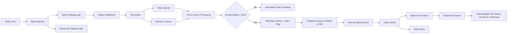
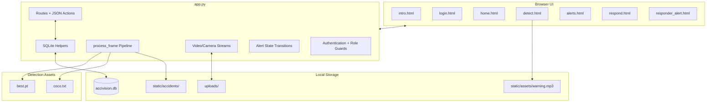
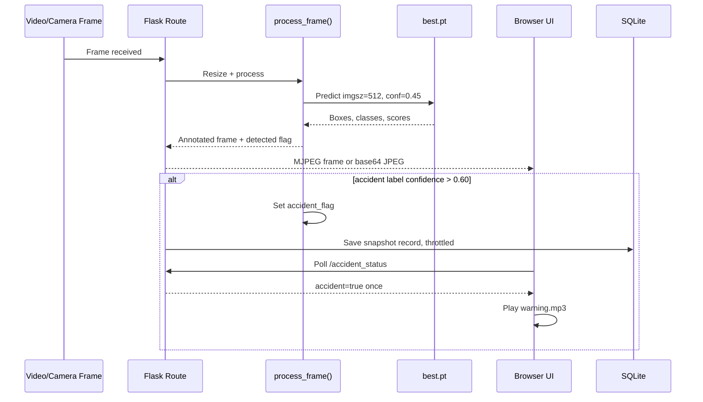
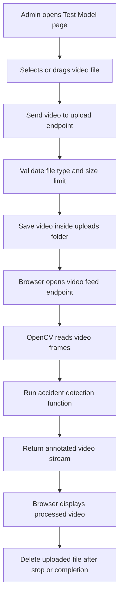
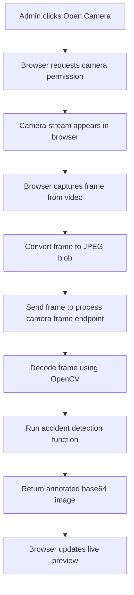
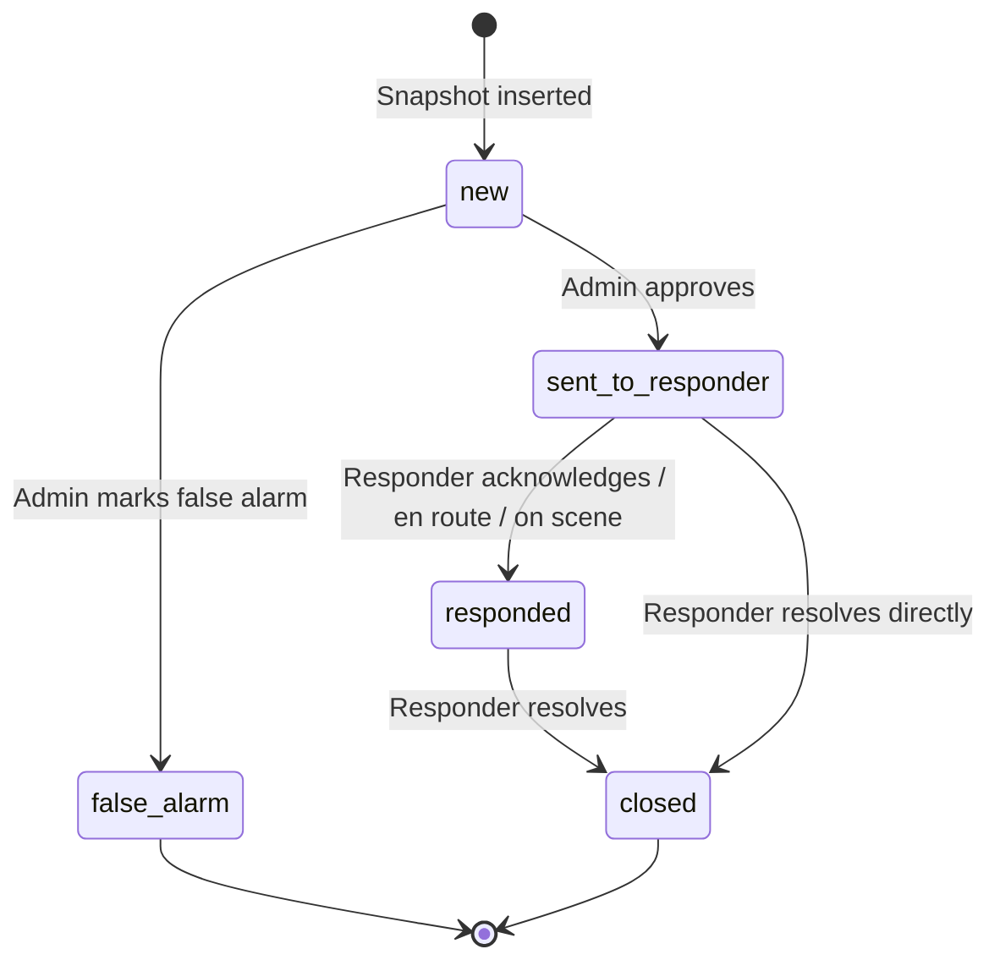

<div align="center">

# 🚦 AcciVision

### AI-Powered Traffic Accident Detection & Response Dashboard

<p>
  
  
  
  
  
</p>

<p>
  
  
  
  
</p>

AcciVision is a Flask-based accident monitoring system that runs a custom YOLO model on uploaded traffic videos or browser camera frames, saves accident snapshots, and routes incidents through an admin review and responder workflow.

</div>

---

## ✨ What This Project Does

| Area | Current Implementation |
| --- | --- |
| 🎥 Detection input | Admin users can upload supported video files or open the device camera from the browser. |
| 🧠 AI model | `best.pt` is loaded once at startup with Ultralytics YOLO and labels from `coco.txt`. |
| 🖼️ Frame processing | Frames are resized, analyzed by YOLO, annotated with bounding boxes, and returned to the browser. |
| 🚨 Alert signal | Accident detections set a server-side flag; the browser polls it and plays `warning.mp3`. |
| 📸 Evidence | Detected accident frames are saved as JPEG snapshots in `static/accidents/`. |
| 🗂️ Persistence | SQLite stores users, saved accident records, lifecycle status, responder status, and timestamps. |
| 👤 Admin workflow | Admins run detection, review incidents, approve alerts, or mark false alarms. |
| 🚑 Responder workflow | Responders see dispatched alerts, inspect evidence, update status, and resolve cases. |

---

## 🧭 System Workflow



---

## 🏗️ Architecture



---

## 🧠 Accident Detection Pipeline

The core detection path lives in `process_frame(frame)` inside `app.py`.

| Step | Code Behavior |
| --- | --- |
| 1. Normalize frame | Every processed frame is resized to `768 x 432`. |
| 2. Run YOLO | `model.predict(frame, imgsz=512, conf=0.45, verbose=False)` runs inference. |
| 3. Read detections | The app reads each YOLO box, confidence score, and class ID. |
| 4. Resolve label | Class IDs are mapped through `coco.txt`, currently `accident` and `cars`. |
| 5. Draw overlays | Accident boxes above `0.60` are red; all other detections are green. |
| 6. Trigger warning | If an accident is detected, the frame gets a warning banner and `accident_flag = True`. |
| 7. Save snapshot | Streaming routes call `try_save_snapshot(processed)` when detection is true. |
| 8. Throttle evidence | Snapshots are saved at most once every `30` seconds. |
| 9. Persist alert | A background thread writes the JPEG and inserts an `accidents` row. |



### Detection Confidence Logic

| Threshold | Meaning |
| --- | --- |
| `0.45` | YOLO prediction confidence threshold used by `model.predict(...)`. |
| `> 0.60` | A detection is treated as an accident only when its label is `accident` and confidence is above 60%. |
| 30 seconds | Snapshot throttle interval between saved accident images. |

> Current code note: the database has `confidence`, `source_video`, and `detection_time_seconds` columns, but the active snapshot insert only stores `id`, `image`, `timestamp`, and `notified`. Therefore confidence and detection-time dashboard values may remain default/empty unless existing database rows already contain those fields.

---

## 🎥 Live Camera & Video Upload Workflows

### Uploaded Video



Supported upload extensions:

`mp4`, `avi`, `mov`, `mkv`, `wmv`, `webm`

---

### Browser Camera



There is also a server-side `/camera_feed` route that uses OpenCV camera index `0`, but the current `detect.html` browser workflow uses `/process_camera_frame`.

---

## 👥 Roles & Workflows

| Capability | Admin / Operator | Responder |
| --- | ---: | ---: |
| View dashboard | ✅ | ✅ |
| Run uploaded-video detection | ✅ | ❌ |
| Run browser-camera detection | ✅ | ❌ |
| Review all non-false-alarm incidents | ✅ | ❌ |
| Approve and send alerts | ✅ | ❌ |
| Mark new incidents as false alarms | ✅ | ❌ |
| View dispatched alerts | ❌ | ✅ |
| Update response status | ❌ | ✅ |
| Resolve incident | ❌ | ✅ |

### Admin Flow

1. Register or log in as `admin`.
2. Open **Dashboard** for live operational metrics.
3. Open **Test Model** to upload footage or start browser-camera detection.
4. Review saved detections on **Alerts**.
5. Choose **Approve and Send** to route an incident to responders.
6. Choose **False Alarm** to hide an unreported incident from live queues while keeping it in the database.

### Responder Flow

1. Register or log in as `responder`.
2. Land on the **Responder Dashboard**.
3. View assigned/dispatched alerts.
4. Open alert details to inspect the saved snapshot.
5. Update the response state: `Acknowledged`, `En Route`, `On Scene`, or `Resolved`.
6. Resolving an alert closes the incident.

---

## 📊 Dashboards & Navigation

| Page | Template | Access | Purpose |
| --- | --- | --- | --- |
| Intro | `intro.html` | Public | Public entry page. |
| Login / Signup | `login.html` | Public | Login, signup, and role-locked registration. |
| Role Selection | `select_role.html` | Public | Select admin or responder before registration. |
| Admin Dashboard | `home.html` | Admin | Active alerts, camera count, events today, average model detection time, recent events. |
| Test Model | `detect.html` | Admin | Video upload detection and browser camera detection. |
| Alert Management | `alerts.html` | Admin | Incident cards, evidence preview, approve/send, false alarm. |
| Responder Dashboard | `respond.html` | Responder | Assigned alerts, pending counts, response status chart. |
| Responder Alerts | `responder_alert.html` | Responder | Assigned case list, detail view, status updates, image enlargement. |

The shared `sidebar.html` changes navigation by role:

| Role | Sidebar Items |
| --- | --- |
| Admin | Dashboard, Alerts, Test Model, Logout |
| Responder | Dashboard, Responder Alerts, Logout |

---

## 🚨 Alert Lifecycle



| State | Stored Value | Visible To | Meaning |
| --- | --- | --- | --- |
| New | `new` or legacy empty status with `notified = 0` | Admin | Detection saved and waiting for review. |
| Active | `sent_to_responder` | Admin + Responder | Admin approved and dispatched the alert. |
| Responded | `responded` | Admin + Responder | A responder has accepted/progressed the case. |
| Closed | `closed` | Admin + Responder | The responder resolved the case. |
| False Alarm | `false_alarm` | Hidden from live queues | Admin dismissed it before dispatch. |

### Responder Status Values

| Value | UI Label |
| --- | --- |
| `pending` | Pending |
| `acknowledged` | Acknowledged |
| `en_route` | En Route |
| `on_scene` | On Scene |
| `resolved` | Resolved |

---

## 🗄️ Database Usage

The application uses SQLite through `accivision.db`. On startup, `init_db()` creates missing tables and adds missing columns with non-destructive `ALTER TABLE` migrations.

### `users`

| Column | Purpose |
| --- | --- |
| `id` | Auto-incrementing user ID. |
| `email` | Unique login email. |
| `password` | Werkzeug hash; legacy SHA/plain values can be upgraded after successful login. |
| `role` | `admin` or `responder`. |
| `created_at` | Creation timestamp. |

### `accidents`

| Column | Purpose |
| --- | --- |
| `id` | Short UUID-based incident ID. |
| `image` | Snapshot filename in `static/accidents/`. |
| `timestamp` | Unix timestamp when the snapshot was captured. |
| `notified` | Whether the alert was sent to responders. |
| `responded` | Whether a responder has acted on it. |
| `closed` | Whether the incident is resolved. |
| `status` | Main lifecycle state. |
| `sent_at`, `reported_at` | Dispatch timestamps. |
| `responded_at` | First responder action time. |
| `closed_at` | Resolution time. |
| `response_status` | Responder progress value. |
| `assigned_responder` | Responder email or `Responder Team`. |
| `confidence` | Schema field for confidence; current insert path leaves it at default unless pre-existing rows include data. |
| `source_video` | Schema field for source video; current insert path does not populate it. |
| `detection_time_seconds` | Schema field for inference timing; current insert path does not populate it. |

---

## 🧩 Route Map

| Route | Methods | Access | Description |
| --- | --- | --- | --- |
| `/`, `/intro.html` | GET | Public | Intro page. |
| `/login`, `/login.html` | GET, POST | Public | Login and signup form. |
| `/select-role`, `/select_role.html` | GET, POST | Public | Role selection before signup. |
| `/register/admin` | GET | Public | Locks signup role to admin. |
| `/register/responder` | GET | Public | Locks signup role to responder. |
| `/logout` | GET | Logged in | Clears session and returns to intro. |
| `/home` | GET | Logged in | Role-aware dashboard redirect. |
| `/dashboard`, `/home.html` | GET | Admin | Admin dashboard. |
| `/detect`, `/detect.html` | GET | Admin | Detection workspace. |
| `/alerts`, `/alerts.html` | GET | Admin | Alert management. |
| `/responder` | GET | Responder | Responder dashboard. |
| `/responder/alerts`, `/responder_alert.html` | GET | Responder | Responder alert list. |
| `/responder/alert/<accident_id>` | GET | Responder | Responder alert detail. |
| `/upload` | POST | Admin | Upload and validate video file. |
| `/video_feed` | GET | Admin | Multipart processed video stream. |
| `/camera_feed` | GET | Admin | Server-side camera stream from camera index `0`. |
| `/process_camera_frame` | POST | Admin | Process one browser camera frame. |
| `/stop_video` | POST | Admin | Stop upload processing and remove active upload. |
| `/stop_camera` | POST | Admin | Stop server-side camera flag. |
| `/accident_status` | GET | Admin | One-shot accident flag for warning audio. |
| `/report_alert/<accident_id>` | POST | Admin | Send incident to responders. |
| `/false_alarm/<accident_id>` | POST | Admin | Mark unreported incident as false alarm. |
| `/respond_alert/<accident_id>` | POST | Responder | Legacy/simple acknowledgement endpoint. |
| `/close_alert/<accident_id>` | POST | Responder | Legacy/simple close endpoint. |
| `/responder/update-status` | POST | Responder | Update responder status. |
| `/contact_authority` | POST | Logged in admin only | Legacy dispatch wrapper. |
| `/mark_responded` | POST | Logged in responder only | Legacy responder wrapper. |
| `/uploads/<filename>` | GET | Logged in | Serve uploaded media while available. |

---

## 📁 Project Structure

```text
accident_web/
├── app.py                         # Flask app, routes, auth, DB, detection pipeline
├── accivision.db                  # SQLite database
├── best.pt                        # Custom YOLO model
├── coco.txt                       # Detection labels: accident, cars
├── requirements.txt               # Python dependencies
├── README.md                      # Project documentation
├── cloudflared-windows-amd64.exe  # Bundled tunnel executable, not called by app.py
├── templates/
│   ├── intro.html                 # Public introduction page
│   ├── login.html                 # Login and signup form
│   ├── select_role.html           # Role selection
│   ├── sidebar.html               # Shared role-aware navigation
│   ├── home.html                  # Dashboard layout
│   ├── detect.html                # Admin detection workspace
│   ├── alerts.html                # Admin alert management
│   ├── respond.html               # Responder dashboard
│   └── responder_alert.html       # Responder list/detail workspace
├── static/
│   ├── css/
│   │   └── style.css              # Application styling
│   ├── assets/
│   │   └── warning.mp3            # Browser warning sound
│   └── accidents/
│       └── accident_*.jpg         # Saved detection snapshots
└── uploads/
    └── uploaded videos            # Temporary uploaded media during analysis
```

---

## ⚙️ Installation & Run

```bash
python -m venv venv
venv\Scripts\activate
pip install -r requirements.txt
python app.py
```

The local development server starts on:

```text
http://localhost:5001
```

Required runtime files in the project root:

| File | Required For |
| --- | --- |
| `best.pt` | YOLO accident detection model. |
| `coco.txt` | Class label lookup. |
| `accivision.db` | SQLite storage; created/migrated by the app if needed. |

---

## 🧪 Current Dependencies

```text
flask
opencv-python
pandas
ultralytics
numpy
```

---

## 🔐 Authentication & Access Control

AcciVision uses Flask sessions and role decorators:

| Decorator | Protects |
| --- | --- |
| `login_required` | Any authenticated route. |
| `admin_required` | Detection, admin dashboard, upload, alerts, dispatch, false alarm. |
| `responder_required` | Responder dashboard, responder alert details, response updates. |

Passwords are created with Werkzeug password hashing. The verifier also supports legacy SHA-256 or plain stored values and upgrades them to Werkzeug hashes after a successful login.

---

## ✅ Implementation Notes

- The YOLO model is loaded once globally: `YOLO(os.path.join(BASE_DIR, "best.pt"))`.
- `coco.txt` currently defines two classes: `accident` and `cars`.
- Browser-camera detection sends JPEG frames to Flask about every `250ms`.
- Uploaded-video frames are streamed back as `multipart/x-mixed-replace`.
- Warning sound is polling-based, not WebSocket-based.
- Saved accident snapshots are throttled to reduce duplicate evidence during continuous detections.
- False alarms remain in the database but are hidden from live admin and responder queues.
- Locations shown in dashboards are generated display labels from the accident ID, not GPS coordinates.

---

<div align="center">

### Built for practical AI-assisted traffic incident monitoring

`Flask` · `YOLOv8` · `OpenCV` · `SQLite` · `Admin Dashboard` · `Responder Workflow`

</div>
